# [HTRU2](https://archive.ics.uci.edu/ml/datasets/HTRU2)

The goal of this repo is to solve the pulsar detect problem in HTRU_2 data set.

Please read report.md to see the result.

## Environment

- Python 3

Using pip to install all the required packages

` pip install -r requirements.txt`

If you did not install python, installing from 
[Anaconda](https://conda.io/docs/download.html) is recommended. 
This will make your life easier.

## Usage

To load the .ipynb files after install jupyter

> `jupyter notebook`

# 脉冲星检测任务

脉冲星是一种罕见的中子星，能产生在地球可探测的电磁波。在脉冲星旋转时会产生具有可探测模式的脉冲讯号。每一个脉冲星的讯号模式都有所不同，且在每一次旋转时都有微小的变化。因此脉冲星的检测具有较大的困难，常常需要大量计算和天文专家的参与。机器学习系统已被运用在脉冲星自动检测问题上。

具体代码：https://github.com/rem2016/PulsarDetectionOnHTRU2

# 任务介绍

该任务使用的数据集是[HTRU_2数据集](https://archive.ics.uci.edu/ml/datasets/HTRU2)。其具有来自脉冲星候选集的众多样本，每个样本都具有8个已处理的特征，和1个是否为脉冲星的标签。其特征具体含义为：

1. Mean of the integrated profile. 
2. Standard deviation of the integrated profile. 
3. Excess kurtosis of the integrated profile. 
4. Skewness of the integrated profile. 
5. Mean of the DM-SNR curve. 
6. Standard deviation of the DM-SNR curve. 
7. Excess kurtosis of the DM-SNR curve. 
8. Skewness of the DM-SNR curve. 

其一共含有16,259个样本，其中只有1,639个来自脉冲星的样本。

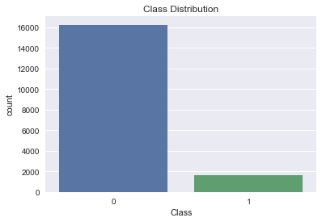

正负样本比例大概在1:9，是一个**样本不平衡**的数据集。在该实验中，我会着重解决这个问题。

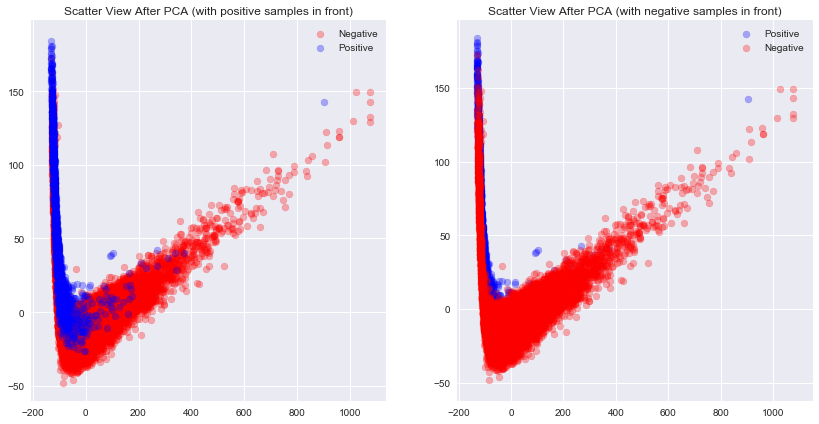

我将数据归一化之后通过PCA降维至二维，之后通过散点图查看数据的分布。通过上图可以发现，
- 在二维空间中很大一部分的正样本可以很轻松的和负样本区分开，所以在这个数据上用简单的方法训练一个还不错的分类器是很容易的事情
- 正样本有很多的离群点混杂在负样本当中，在二维空间上无法将他们区分开，需要更高维度的信息。所以要训练出很好的分类器会比较困难

# 数据流

## 预处理

该数据集当中的数据干净完整，没有缺失，预处理工作量较小。且特征数量较小，并且没有太多人工设计特征的余地，所以没有进行特征工程的需要。

但是该数据集当中的8维特征的分布范围不同，这会为部分模型的训练带来问题，所以需要进行标准化。

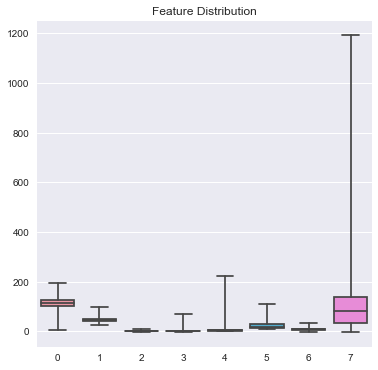

### 数据集分割

本实验小部分内容将按照测试集占30%的比例将数据分为训练集和测试集。但实验主要内容都将使用k-fold的方法进行cross-validation的评估，其中每轮评估都会重新划分一次训练集和测试集，folds的数量固定为3。

其中ensemble的模型因为需要有额外的validation set来进行ensemble model的拟合，所以在ensemble模型的实现中会再将训练集进行划分。

### 标准化

在该任务当中我考虑了两种标准化方法

1. Standar: $a = (a - mean(a)) / std(a)$
2. MinMax: $a = (a - min(a)) / (max(a) - min(a) )$

再具体实现中，这个标准化过程发生在数据集分割之后，被内置在模型内部。
1. 在训练时，我在training set上进行标准化，并记录下相关参数，比如最大值最小值/平均值标准差
2. 在预测时，通过记录的最大值最小值/平均值标准差，对输入进行一次一样的转换，之后再进行预测

这种实现方式可以让标准化方法成为模型的一个可调整参数，在后续tuning时我们可以针对每一个模型寻找最佳的标准化方法。

### 数据集重采样

本实验将尝试多种解决样本不平衡问题的方法，包括了上采样下、下采样等会影响数据集的方式。

**这个步骤要在分割训练集测试集之后，在训练集上进行**。否则在上采样的时候会造成数据泄露的问题，导致模型在Evaluation当中呈现效果很好的假象。这种数据泄露的问题时常出现在数据挖掘竞赛中，导致选手的线下Evaluation和线上Evaluation的结果差距巨大，为后续的分析和Debug带来很大困难。

**该步骤也要在标准化之后进行**。因为我们在下文中用到了SMOTE及其变种等上采样方法，他们中有多个是基于KNN的，如果不进行标准化，KNN很容易受到变化较大的特征列的影响。

## 模型调参与评估

如上文所述，评估模型时我使用的方法是k-fold，其中k=3。其中每一次都会再执行一遍上述的所有预处理操作，之后再在训练集上训练，测试集上评估，取三次评估结果的平均数作为最终的分数。

### 将预测分数转换为预测类别

部分模型预测时只能给出score，而不给出具体的预测类别，比如我们在通过vote ensemble别的模型时。而如果要计算fscore，具体的类别信息，而不是score。为了解决此问题且不影响评估结果，我在**训练集**上寻找使f1 score最高的最佳的阈值作为二分类的阈值，在预测时使用该阈值直接进行预测。

### 超参数选择

超参数有可能会对当前的数据样本过拟合，造成最终模型评估结果不真实。所以在挑选超参数之前，需要先进行整体训练集和测试集的分割，之后只在训练集上进行超参数的选择。

这部分因为需要的训练时间很长，且实现的方式的自动化程度不高，还涉及到了很多人工操作。所以此处不进行k-fold来进行校验。

下图更清晰地描述了整体数据流。

2. 在预测时使用所有的分类器进行预测，将预测分数值累加

# 模型

在该实验当中我主要使用了以下几种模型：

- KNN。KNN算法在样本密集且特征较少时(没有维度诅咒)以有比较好的效果。该问题的特征数量少，可以尝试使用KNN去解。
- SVM。本问题当中的总体样本数量只有1万，且特征数量较少，且是二分类问题，很适合使用SVM去解。
- Decision Tree。决策树是一种树形结构的分类器，其叶子节点对应着几个其见过的实体，通过他们的类别来预测未来的分类。所以我们可以在结果中看到，决策树的roc\_auc分数基本都很低，因为他们对概率的预测相对其他模型更没有意义。在样本不平衡的问题中，除了下面将介绍的上采样方法以外，从决策树本身的角度来讲，我们最好将决策树的min_sample_leaf，即叶子上最少样本数设置成1，让稀有样本可以占据单独的叶子节点。
- Logistic Regression。逻辑回归是一种线性模型，它有较好的抗噪声能力，该问题中特征数量不大，逻辑回归可以比较好得运用在这个问题上。
- XGBoost。XGBoost 大规模并行boosted tree的工具，在数据挖掘竞赛当中常常能见到它的身影。
- 其它Ensemble方法。除了XGBoost，在这个问题中我还考虑了基于voting和基于logistic regression的Ensemble的方法来综合其它分类器的结果。

其中每个模型都有自己需要搜索的超参数组合，将他们合并时也有需要考虑的超参数。并且为了解决样本不平衡问题所使用到的方法也是一个超参数的选项，即需要选择的。我使用了Greedy Search的方法来寻找最好的参数。

# 样本不平衡问题

此部分的解决方案参考了：
- Kaggle [How To handle Imbalance Data : Study in Detail
](https://www.kaggle.com/gargmanish/how-to-handle-imbalance-data-study-in-detail)
- Jason Brownlee [Tactics to Combat Imbalanced Classes in Your Machine Learning Dataset](https://machinelearningmastery.com/tactics-to-combat-imbalanced-classes-in-your-machine-learning-dataset/)
- Quora [In classification, how do you handle an unbalanced training set?](https://www.quora.com/In-classification-how-do-you-handle-an-unbalanced-training-set)

针对样本不平衡问题的解决方案可以大体分为两种：
1. 调整模型的目标函数
2. 重新采样原始数据集

评价指标方面，对于样本不平衡的问题我们不能直接使用Accuracy来进行衡量。对于二分类问题，$accuracy = \frac{TP + TN}{TP + TN + FP + FN}$，该指标会不可避免得偏向大类，导致样本不平衡时小类别上的分类效果差的问题变得难以察觉。所以在该实验中我主要采用两种评价指标：
1. F1 Score。在该问题当中，正样本数量较少，且我们更关注正样本的分类效果，我们可以使用$f1 = \frac{2TP}{2TP + FP + FN}$来作为更客观的评价指标。
2. [ROC AUC](https://en.wikipedia.org/wiki/Receiver_operating_characteristic)。ROC(Receiver Operating Characteristic)曲线和AUC(Area Under the Curve)常被用于评价二分类器的分类效果。其可以在只考虑分类器给出的预测分数的情况下（而不需要分类器明确给出0或1的答案）进行分类器效果的评估。

为保证Evaluation的有效性，该节中所有的Cross Validation的数据分割是相同的，每个模型的随机种子也是相同的。(TODO 2 Write test)

## 模型角度的解决方案

本节讨论通过调整模型的方式抵抗样本不平衡的问题的解决方案。

此部分针对各个模型都有独立的试验，每次都将使用k-fold来对比使用对应解决方案之前和使用之后的效果对比。

本文中我们主要考虑四种模型：SVM, Logistic Regression, Decision Tree, XGBoost。

### 基本介绍

在一些模型中，其得分函数/惩罚函数是可以根据每个样本的权重来分配权重的。在这些模型中，我们可以给数量更少的类别的样本分配更高的权重。通过这种方式，能够实现在以ROC_AUC作为评估指标时达到很好的效果。

但是通过这种方式可能会带来的负面效果是它会造成所给出的概率预测值失去意义。因为在数据是服从负样本更多的分布情况下，预测的概率值一定也是向负样本bias才更有意义。

在本部分实验中没有被进行上采样或下采样等添加或删除原始数据的操作，控制变量方便观察模型在分配样本权重和不分配样本权重的情况下的效果。

### 具体实现

实现上来说，我在该实验当中使用的[scikit-learn](http://scikit-learn.org/stable/)工具集中大多数分类器都提供了sample_weights \| class_weights的参数用以调整样本或是类别的权重。

XGBoost对于非平衡数据样本有独立的参数可以进行调优。

在XGBoost的[参数列表](http://xgboost.readthedocs.io/en/latest/parameter.html) 当中有一项为

- scale_pos_weight, [default=1]
	- Control the balance of positive and negative weights, useful for unbalanced classes. A typical value to consider: sum(negative cases) / sum(positive cases)

这个参数的具体实现没有在官方文档中给出，但是根据有人在stackexchange当中提到的[一个问题](https://stats.stackexchange.com/questions/243207/what-is-the-proper-usage-of-scale-pos-weight-in-xgboost-for-imbalanced-datasets)，可以看到在`RegLossObj.GetGradient`下有这样一行代码：

`if (info.labels[i] == 1.0f) w *= param_.scale_pos_weight`

所以可以推断，具体的实现方式就是调整正样本的学习率。如果正样本较为稀疏，就可以将该值设置更大，这样一个正样本带来的反馈就近似等于若干个这样的正样本能带来的。

## 数据角度的解决方案

此部分主要从数据的角度入手，而不从模型本身入手。所以在本节中使用的模型将不采用任何调整样本权重的技巧。

### 基本方法

#### 随机上采样

该方法直接创造稀有样本的副本来实现上采样

#### 随机下采样

该方法直接随机删除非稀有样本来实现下采样

### SMOTE

SMOTE[1]及其变种[2][3]是Over-sampling的算法

SMOTE通过一种基于KNN的算法来生成假的稀缺样本的数据。其原始算法[1]通过随机挑选样本点$\mathbf{x}$，并通过KNN选择5个最近的样本，再从这五个样本中之随机挑选两个样本$\mathbf{a}$, $\mathbf{b}$，新生成数据样本$\mathbf{x'}=\mathbf{x} + rand() * (\mathbf{a} - \mathbf{b})$。这种方法能够有效解决C4.5决策树、Naive Bayes、Ripper在直接随机上采样中存在的过拟合的问题。其变种[2]只在类别的边界生成稀有样本的数据，[3]则基于SVM分类器来生成边界上的样本。

## 其它方法

### 切割大类法

该想法来自于 [In classification, how do you handle an unbalanced training set?](https://www.quora.com/In-classification-how-do-you-handle-an-unbalanced-training-set)

假设大类样本为负样本，稀有样本为正样本。

这种方法通过将对所有负样本进行聚类，聚类数目为N，N=大类样本数/小类样本数。之后训练N个二分类器，用于区分聚类和正样本。最后基于validation set来ensemble所有的二分类器。

在这里我尝试了两种实现方法：
1. 在预测时先根据之前的聚类对被预测样本进行聚类类别预测，之后根据对应这个聚类的分类器来进行预测
2. 所有模型进行投票

## 评估

下面列举了多种解决样本不平衡问题的办法在各个模型上的ROC AUC Score 和F1 Score。所有Score都是通过k fold交叉校验之后取平均值得到的。

其中下划线左边代表了所使用的模型，下划线右边代表所使用的解决上采样问题的方法。

模型包括：

- Decision Tree
- LR. Logistic Regression
- SVM
- XGBoost
- ClusterBased. 这种方法指的是上述的切割大类法，这种方法需要一个基分类器用来进行分类。我在这里考虑使用了DecisionTree, Logistic Regression, SVM。在我的源码实现当中这种模型在预测时有两种类型
	- cluster. 在预测时先根据之前的聚类对被预测样本进行聚类类别预测，之后根据对应这个聚类的分类器来进行预测
	- vote. 所有基分类器进行投票

使用的针对样本不平衡的解决措施包括：

- origin. 原始分数
- upsampling$n$. 数字$n$代表负样本比正样本的比例
- downsampling$n$. 数字$n$代表负样本比正样本的比例
- model_balance. 不对数据进行调整，而调整样本在训练时的权重
- smote. SMOTE
- sm_bl1. SMOTE 变种Borderline1
- sm_bl2. SMOTE 变种Borderline2
- sm_svm. SMOTE 变种SVM

### ROC AUC Scores

总体上看，主要就只有ClusterBased 的方法低于0.9分。这个是在预期之内的，因为ClusterBased的方法的预测score并没有很大意义。

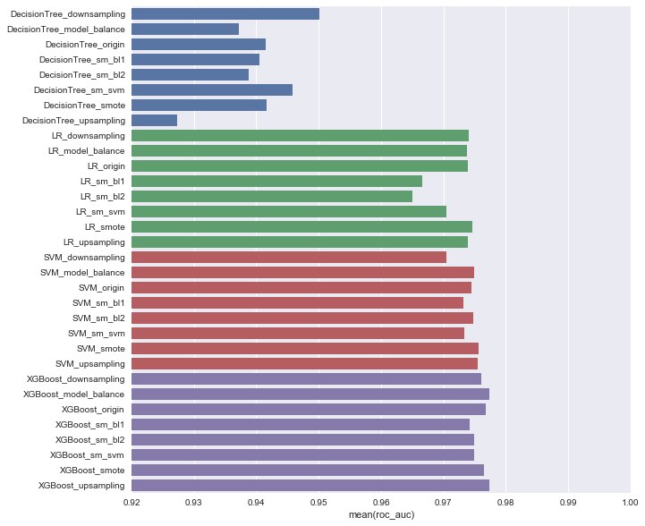

缩小X轴范围到[0.92, 1]

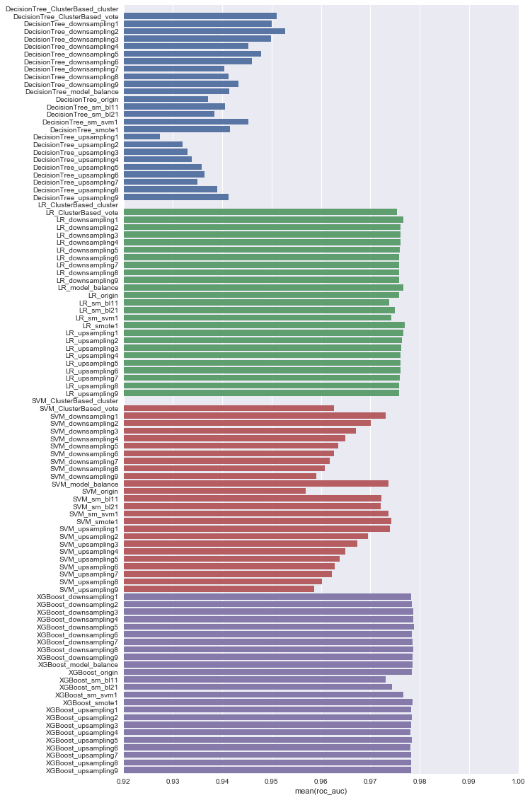

### F1 Score

比例尺为[0.6, 1]
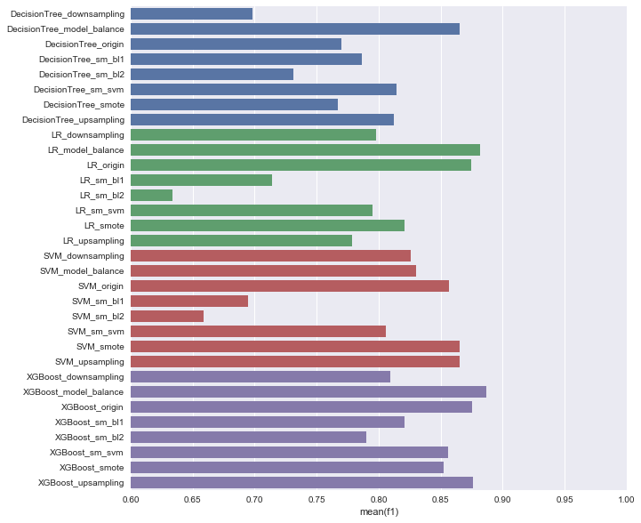

### 分析

#### 不同负正样本比例

上面的图当中y轴坐标里的最后一个数字的含义就为负正样本比例。在观察该比例时应该注意我所设定的从1:1 到9:1的变化的间隔比例是差异很大的，从2:1到1:1就是再下采样50%的差距，而从9:1到8:1就只有再下采样11.11%。所以我们能观察到从1:1 ~ 2:1 之间往往有一个比较大的变化，而从4:1 ~ 9:1的变化就都不明显。

从上面的图中我们可以发现，模型的效果并不会随着负正样本比例的变化而统一变化。如决策树，在通过下采样使负正比例平衡的过程中，其roc auc越来越高，而其对上采样则相反。

f1 score上，我们可以看到多个模型在下采样或者上采样过程中我们可以看到在负正比例为4:1 ~ 5:1时效果最好。而在1:1时效果都相对其它更大的比例更差。这背后的具体原因有待深入，但可能的原因有：

1. 对于下采样方法，这个范围相对比较中性，在减缓对正样本的bias的情况下不损失太多信息。以原本9:1的正负比例下采样到5:1所所损失的信息较少，只有损失44.44%的信息，而下采样到1:1就要损失88.89%的信息。
2. 对于上采样方法，这个范围在减缓对正样本bias的情况下不创造过多重复样本，导致模型过拟合。

#### 调整样本权重方法（balance)

我们可以对比图中的后缀为balance的和后缀为origin的，二者差别仅仅在于前者根据稀有类型调整了样本权重。我们可以发现在所有模型中使用了balance 方法的roc auc值都高于origin，而在f1 score上则恰恰相反，balance方法的f1都低于origin的f1 。所以**调整样本权重的方法在提高roc auc分数时同时降低了f1 score**。

#### 决策树

决策树的roc auc scores相对偏低。这个也是预期之内的，因为决策树所给出的score是基于叶子上的实例的，它所给出的score更没有其它分类器所给出的score含有的意义多。

而我们具体来看决策树的分数，可以发现决策树在下采样时，随着负样本数量越来越少效果越来越好，而在上采样时随着正样本数量增多，模型效果越来越差，甚至比模型原始的分数还要低很多。这背后的原因很有可能是决策树的默认参数导致决策树在正样本数据上过拟合，所以我们应当在fine tune决策树之后再进行一次得分对比。

SMOTE方法对该决策树有一定帮助，但是没有直接下采样起到的帮助大，这些方法中都有涉及到下采样的过程，所以此处没有太多的分析意义。

#### Logistic Regression

LR 模型在roc auc上得分普遍偏高，仅仅次于XGBoost。但是在f1 score上Logistic Regression很受SMOTE方法的影响。

#### XGBoost

过多的上下采样至正负样本1:1所得到的f1 score都不如XGBoost模型自身的原始结果。并且SMOTE的方法在此处对模型的结果影响很大

#### SMOTE

我们可以发现，所有的SMOTE重采样的方式在每一个模型上都失效了。可能的原因有：

1. 该数据集的数据分布不适合使用SMOTE来创造更多样本。SMOTE重采样方法是对数据的分布有假设的。SMOTE的方法创造的样本很有可能会引入太多噪声信息。
2. SMOTE的超参数设置不够好

# 调参优化

如前文所述，为了保证最终评估效果的客观，在超参数调优之前应该先划分出一部分测试集，用于测试超参数调优之后的模型。这里的测试集的比例是0.3 。

在具体实现上，我通过贪心的方法进行超参数的优化，每次都通过cross validation来获取模型的得分。具体来说，我事先定义好超参数有哪些，和他们的范围，之后该方法逐个挑选最佳的超参数来挑选最佳的分类器。比如超参数A和B，都有1~3三种取值，那么这个方法就会先固定B为默认值，寻找最佳的A使score最大化，找到最佳的A之后将A固定为该值再寻找最佳的B。

**XGBoost 调参**

我依照[Complete Guide to Parameter Tuning in XGBoost](https://www.analyticsvidhya.com/blog/2016/03/complete-guide-parameter-tuning-xgboost-with-codes-python/)给出的调参方法进行调参。该方法中通过先设置高学习率和少的树木数量来加快训练速度，然后开始其它参数的逐个或者两个参数的组合进行贪心的调参，最后调进行高学习率和多树木数量的参数。文章中明确指出了需要调整的贪心参数顺序，和需要调整的重要参数，节省了大量的调试时间。

	max_depth=不限制深度, min_child_weight=1, learning_rate=0.03, n_estimators=400, gamma=0.0, 不进行重采样

交叉校验中平均得分为0.890

**SVM**

最佳参数为

	C=4, gamma=0.0125, kernel=rbf, normalizer=standard

交叉校验中平均得分为0.865

**LR**

最佳参数为

	C=1, normalizer=standard, penalty=l1, sample_method=upsampling, sample_ratio=0.25, tol=0.0001

交叉校验中平均得分为0.83

**Decision Tree**

	max_depth=None（即不限制深度）, min_sample_split=2, normalizer=standard

交叉校验中平均得分为0.824

## 结果评估

以下结果是利用在训练集上学到的超参数，重新在该训练集上进行训练，在测试集上测试得到的结果。其中的Confusion Matrix和Classification Report 的结果是该模型在测试集的结果。

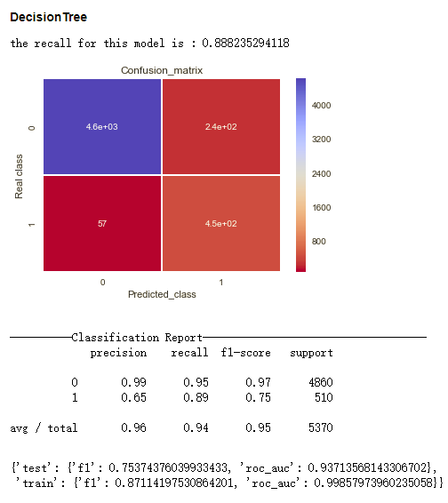

-----

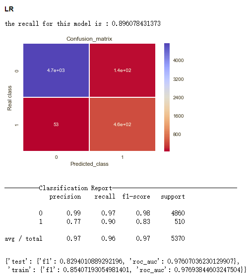

--------

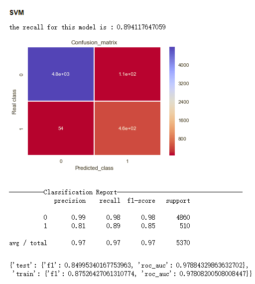

------

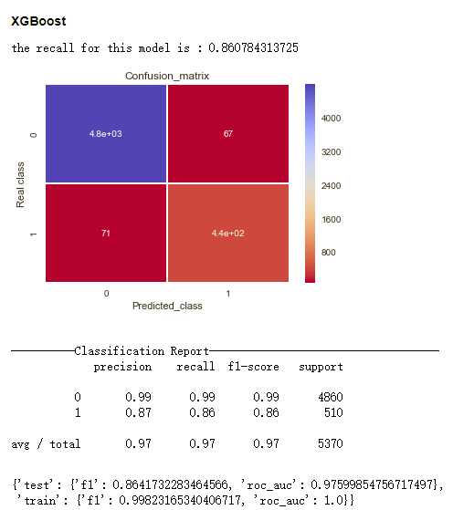

-------

从f1 score来看

1. XGBoost, 0.864
2. SVM, 0.850
3. Logistic Regression, 0.829
4. Decision Tree, 0.754

其中因为最终确定的超参数设置当中，XGBoost和Decision Tree的树深度没有受到限制，导致XGBoost和Decision Tree在training set上的分数和在test set上的分数差距很大，XGBoost在train set上的f1分数甚至达到了0.998，有较为明显的过拟合现象。

# Ensemble

## Predict Probability Ensemble

设输入为X， 输出为y。这种方法是将多个分类器在输入X上所给出的类别概率预测的结果组合起来作为一个输出结果。这种组合方式可以有两种：

- 直接投票，将得分最高的类别作为输出结果
- 通过投票分类器cls组合输出结果
	- 训练。将训练集划分为A、B两部分，其输入输出分别为XA, yA, XB, yB。首先用XA, yA训练所有的基分类器。之后用所有的基分类器去预测XB，合并所有模型对B的输出结果，设其为predX。之后我们以以predX为输入，以yB为输出训练cls分类器，用以综合投票结果。
	- 预测。所有基分类器对输入X进行预测，将预测结果合并得到pred，之后以pred作为cls输入，将cls的输出作为我们的最终输出。

因为基分类器的输出的相关性越小，组合之后的分类效果才会越小，所以在具体实现上我还做了以下调整：

- 决策树的节点分割策略从'best'改为'random'
- 对训练基分类器时，每次随机在分割输入X后的A数据集上扔掉drop\_rate比例的样本

我将DecisionTree, Logistic Regression, SVM作为基分类器，其中各有15个。

我考虑了两种投票分类器，logistic regression和MLP。LR模型的validation\_rate=0.2, drop\_rate=0.3。MLP模型的validation\_rate=0.5, drop\_rate=0.5，一层隐藏层，隐藏层节点个数为15。其结果如下所示。

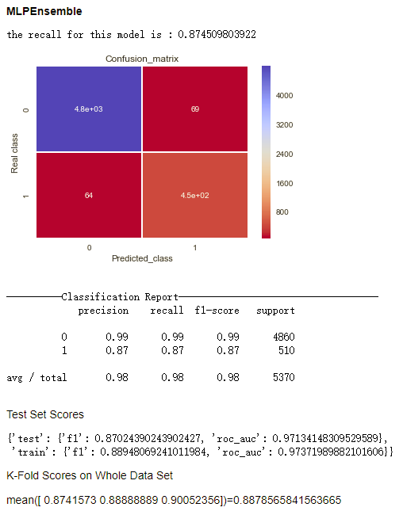
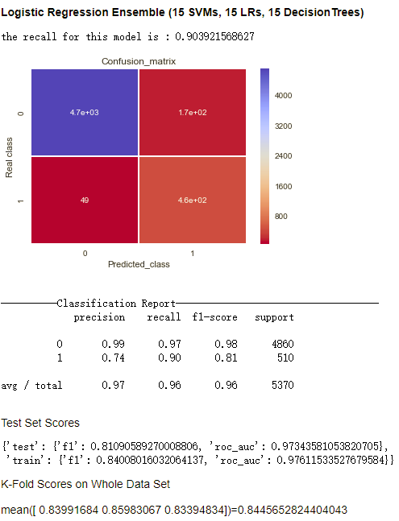

可以看到MLP模型对模型总体的提升较为明显，而LR模型的效果不尽人意。原因是LR作为综合分类器只能学到对各个样本所分配的权重，而很难学习到各个基分类器之间较为复杂的表达组合。所以在基分类器数量较多的情况下它很难有好的表现。

我降低了LR模型中的基分类器的数量为一个LR，一个SVM，和一个Decision Tree以下是新的结果。

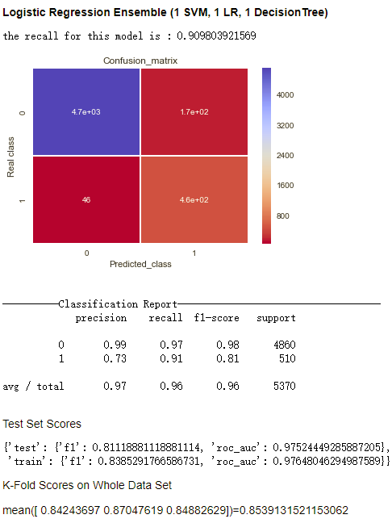

可以看到，其结果甚至略好于用LR模型综合了许多基分类器的结果。所以在利用LogisticRegression的时候，基分类器的数量不宜过多。

## Stacked Ensemble

Stacked Ensemble具体的方式为我先使用若干个简单的分类器，在保证high recall的情况下过滤掉负样本，之后的模型再在该过滤后的样本上进行训练。这种过滤是在训练时和测试时分别在训练集上和测试集上发生的，而不是直接对整个数据集进行的，否则Evaluation过程会有数据泄露的问题。

这种Stacked的方式可以很好的处理正负样本不平衡的问题。这种处理方式的灵感来自于[第一届天猫推荐大赛的一等奖得主的解题思路](https://www.csdn.net/article/2014-08-27/2821403-the-top-9-of-ali-bigdata-competition/9)。

其中我设定了min\_recall的参数，使recall保持在这个阈值之上时过滤掉尽量多的负样本。在下面的输出结果中，min\_recall被设置为0.99。具体实现可见代码model/model.py StackedEnsembleModel class。

我尝试了多种模型的组合，效果见下图

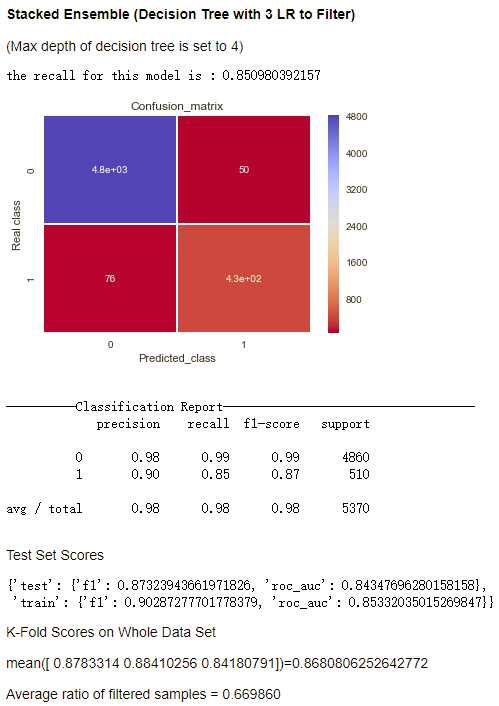

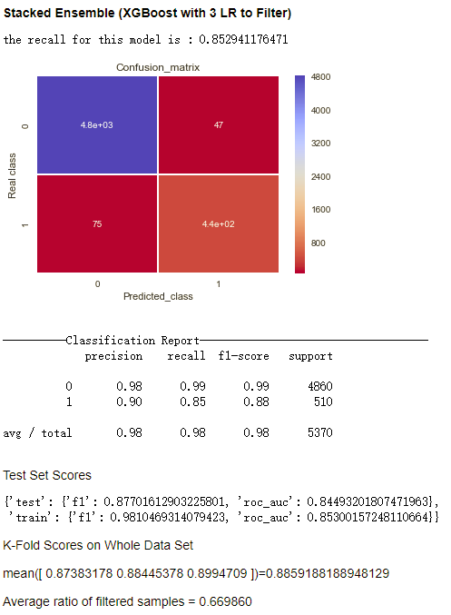

- 过滤器能够过滤掉67%的样本（之所以每一次过滤掉的比例都完全一致是因为为了保证每次运行输出结果一致，实现中所有的random\_state, random\_seed都被设定为固定值）
- 相比之前的模型的结果，这种方法在保证recall的情况下显著提升了precision

在这种框架下，输入到最后的分类模型的数据分布和原始的数据分布是不一样的，所以如果要进一步对该模型进行优化，还需要对超参数的组合进行进一步的探索。

# 参考文献

1. N. V. Chawla, K. W. Bowyer, L. O.Hall, W. P. Kegelmeyer, “SMOTE: synthetic minority over-sampling technique,” Journal of artificial intelligence research, 321-357, 2002.1-356.
2. H. Han, W. Wen-Yuan, M. Bing-Huan, “Borderline-SMOTE: a new over-sampling method in imbalanced data sets learning,” Advances in intelligent computing, 878-887, 2005.
3. H. M. Nguyen, E. W. Cooper, K. Kamei, “Borderline over-sampling for imbalanced data classification,” International Journal of Knowledge Engineering and Soft Data Paradigms, 3(1), pp.4-21, 2001.
